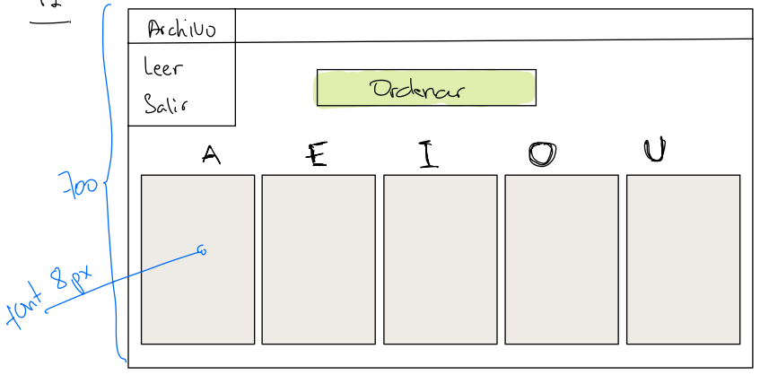

# Práctico 1 - Ordenamiento

El objetivo de este práctico es el de poder leer una lista
de palabras desde un archivo. Luego se deberá colocar las 
palabras del archivo en 5 grupos (uno por cada vocal del 
alfabeto). Finalmente, el sistema implementa un botón 
que realiza el ordenamiento sobre los 5 conjuntos de 
palabras.

## Requerimientos

No se puede utilizar un método de ordenamiento de alguna
de las clases de conjuntos de objetos. Por ejemplo, no 
se puede utilizar el método sort() de la clase List. Se debe
utilizar un método de ordenamiento implementado en su 
mismo programa.

## Interfaz

La interfaz debe ser similar a la siguiente:

Cuando se hace clic en la opción de Leer aparece una
ventana para que se pueda elegir el archivo donde se 
encuentran las palabras.

Luego de seleccionar el archivo el programa separa
cada palabra en su respectivo grupo y los muestra en
la pantalla.

Las palabras que NO comiencen con las letras designadas
(vocales) se descartan.

## Archivo de ejemplo

A continuación puede descargar un archivo de ejemplo 
para la lectura de estas palabras.

[Descargar archivo](./palabras.txt)

## Entrega

La presentación de este práctico se realizará de manera
presencial el viernes 29 de marzo. El cuestionario que se
debe responder es el siguiente:

1. ¿Cuál es el método de ordenamiento que utilizó? Explíquelo.
2. Explicar una sección de código indicada por el profesor
3. ¿Cómo sabes que te muestra de verdad todas las palabras
que terminan en vocales?
4. ¿Cuáles son las validaciones que se han colocado?
5. Mostrar el archivo de logs y mostrar que tiene contexto
luego de un par de ejecuciones del programa.

