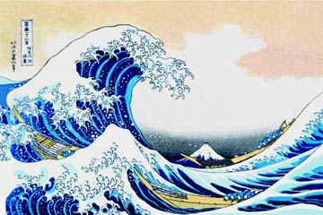
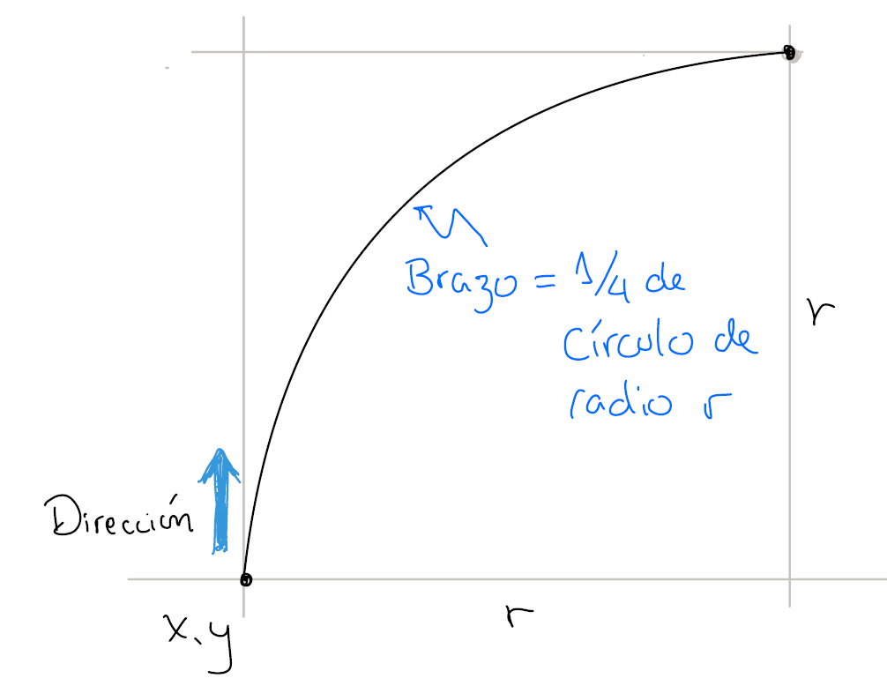
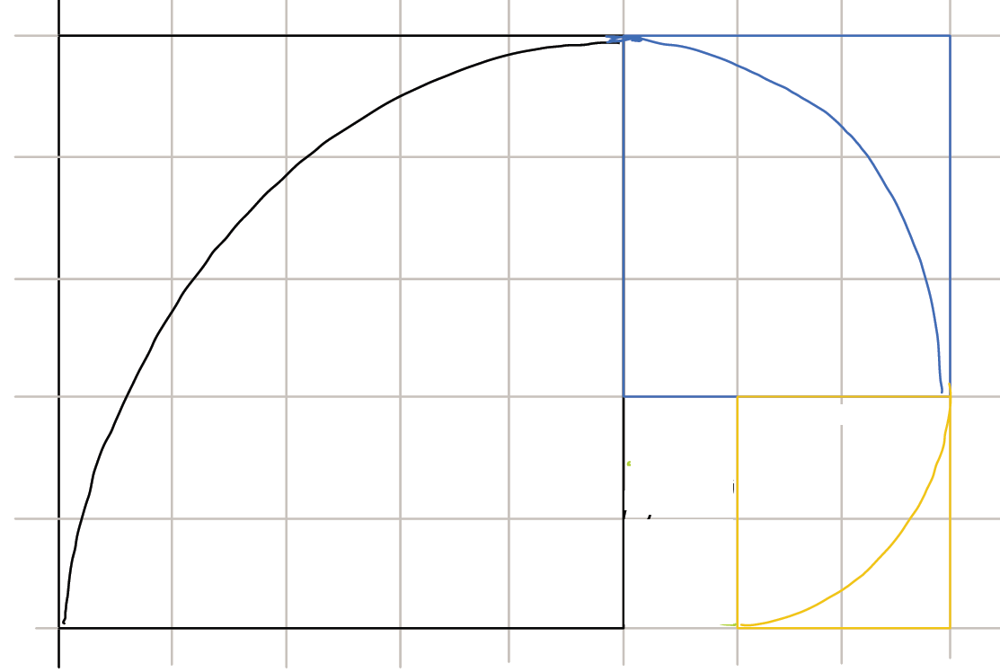

# Práctico 2 - Espiral de Kanagawa

El objetivo del ejercicio es reproducir el fractal
de la ola de Kanagawa pero como una simple línea que 
forme una espiral.

## Historia

La gran ola de Kanagawa es una imagen publicada en 1832,
que como se ve tiene una complejidad y detalle elaborada
para la época y una exactitud en la representación que se
ve reflejada en la forma de la ola.

El objetivo del ejercicio es crear una espiral que se asemeje
a la ola de Kanagawa. 

## Requerimientos

Para realizar el ejercicio se necesitan los siguientes
parámetros:

- Radio del primer brazo de la espiral
- Profundidad de la espiral
- Punto x,y inicial
- Dirección hacia la cual se dirige el brazo (por defecto 
hacia arriba si no está definido)

Este caso sería el de dibujar la espiral en el punto
x,y con dirección ARRIBA, radio r y profundidad 1.

Y a continuación el ejemplo con profundidad 3.

Cada vez que se dibuja un brazo de la espiral, para el
próximo brazo, se debe:

- disminuir la profundidad de 1
- dividir el radio entre 1.618034 para reducirlo (este 
es el número áureo)
- cambiar la dirección en sentido horario (ARRIBA -> DERECHA -> ABAJO -> IZQUIERDA)

Y continuar con el dibujo hasta que la profundidad 
llegue a 0 en cuyo caso se termina el dibujo.

## Interfaz gráfica

La interfaz es un panel que está inicialmente vacío.
El usuario, al hacer clic en cualquier punto del panel,
marca el punto (x, y) donde será el inicio de una espiral.
Al hacer clic aparece un cuadro de diálogo donde el usuario
ingresa el radio del primer brazo en píxeles y la profundidad.
Al hacer clic en OK, se dibuja la espiral en el panel.

## Condiciones de implementación

La clase espiral implementa una espiral y tiene un método
dibujar que sirve para ello. Todos los parámetros para dibujar
la espiral deben estar en el objeto como atributos.
El patrón Observer está implementado y el objeto espiral
es el modelo observado que es dibujado en el panel que
hace de observador.

## Presentación del práctico

La presentación se realizará el día viernes 19 de abril.

Las preguntas que se deben responder son:

1. Qué método es recursivo en su programa? Explique.
2. Cómo maneja el clic del ratón en la interfaz gráfica?
3. Se pueden dibujar varias espirales en el panel? 
Cómo se podría hacer?
4. Qué es el patrón Observer y cómo lo implementó en su
programa?